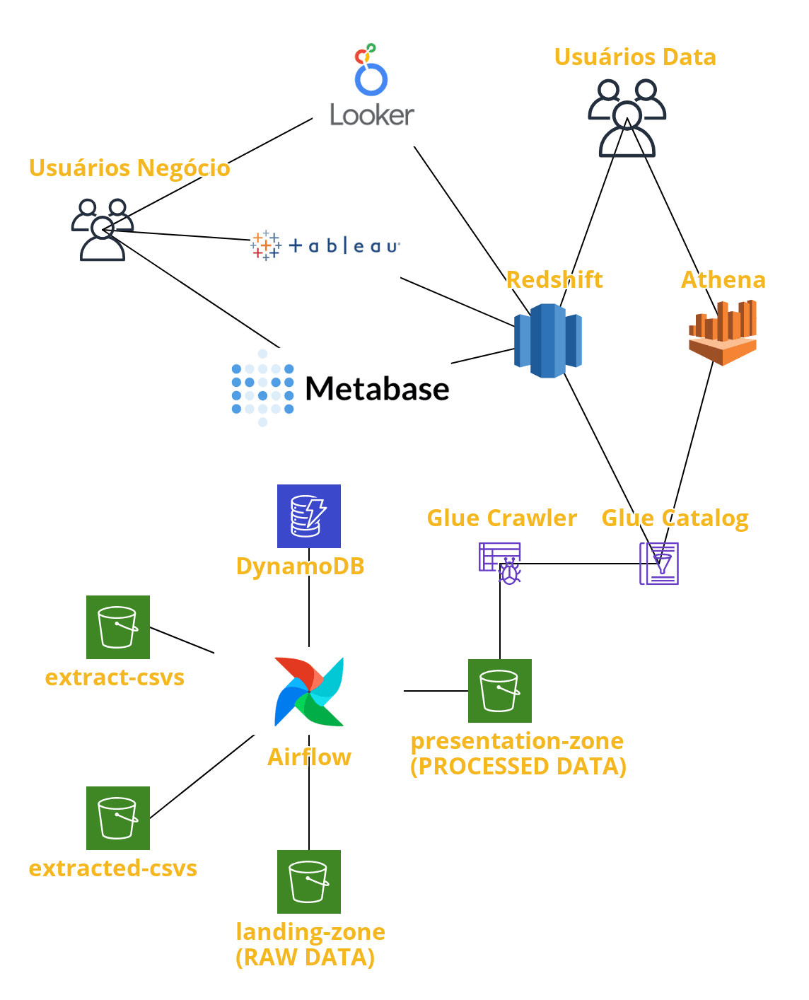

## Arquitetura do Projeto



**Observações:** Na implementação foi utilizado o MongoDB no lugar do DynamoDB e o S3 foi representado como pastas locais.

### DAGS Criadas:
* **ingest_csvs**: Verifica diariamente se existem arquivos .csv na pasta extract-csvs, caso existam, as move organizadamente para a landing-zone alterando a extensão do arquivo para parquet e move os .csv para a pasta extracted-csvs indicando que aquele arquivo já foi extraído.
* **orders_finished_delivered_per_channel_day**: Verifica diariamente se existem novos arquivos parquet na landing-zone, caso existam, os processa e os disponibiliza na presentation-zone com métricas de soma, média, mediana, valor mínimo, valor máximo, desvio padrão e variância do valor do pedido, custo de entrega, taxa de entrega e distância em metros dos pedidos finalizados e entregues por canal e dia.
* **payment_paid_per_day**: Verifica diariamente se existem novos arquivos parquet na landing-zone, caso existam, os processa e os disponibiliza na presentation-zone com métricas de soma, média, mediana, valor mínimo, valor máximo, desvio padrão e variância do valor do pagamento e taxa do pagamento dos pedidos finalizados e pagos por método de pagamento e dia.

### Como subir o ambiente:

1. Execute o seguinte comando para os serviços serem iniciados:

    ```sh
    $ docker-compose up
    ```

2. Acesse o Airflow em http://localhost:8080/
3. Ative a DAG **ingest_csvs** e aguarde a primeira execução para que os arquivos sejam disponibilizados na landing-zone.
4. Ative as demais DAGs.